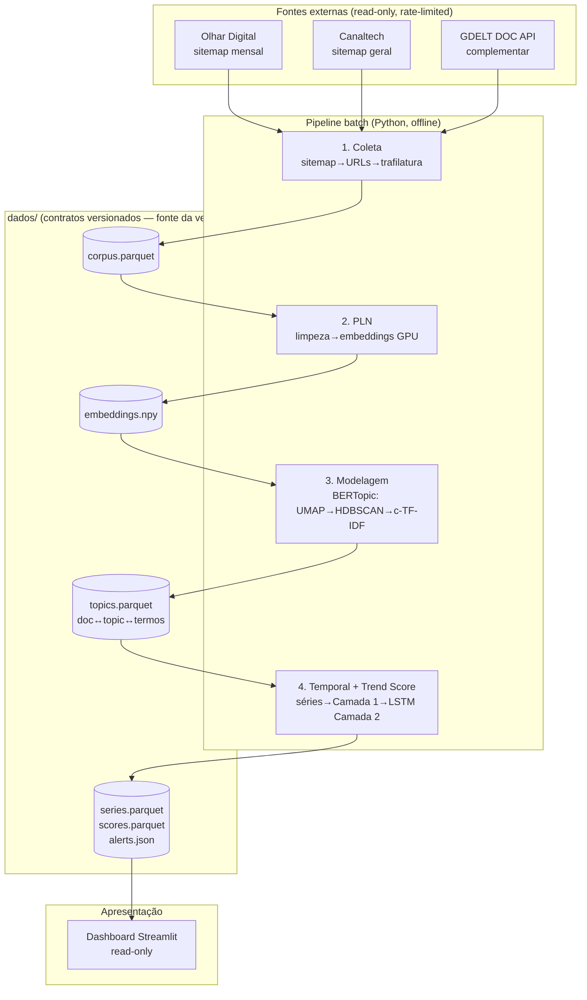
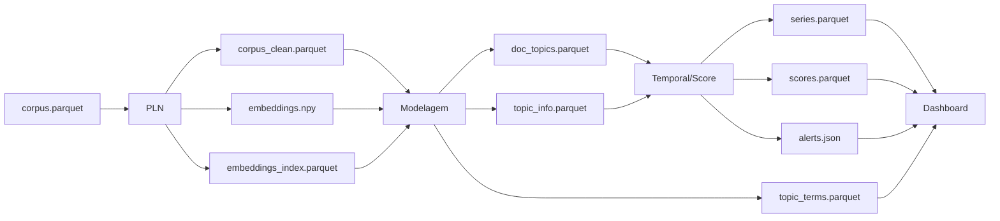
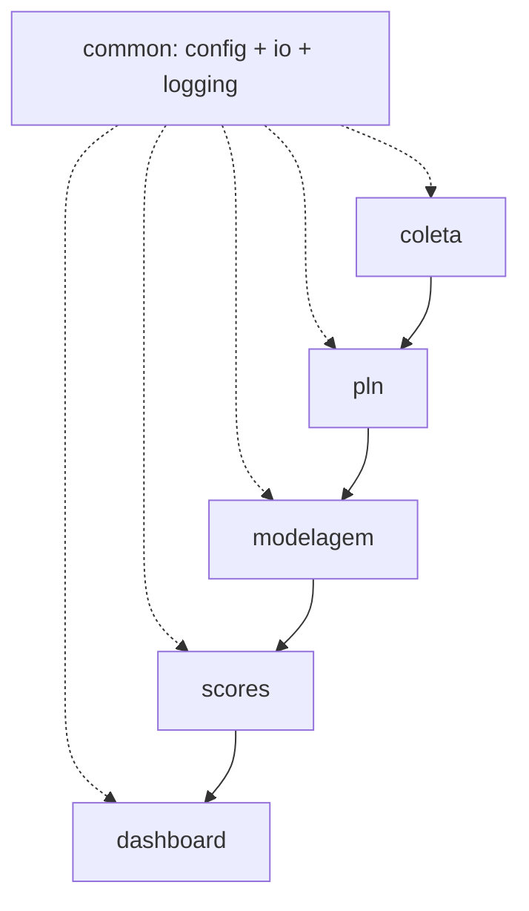
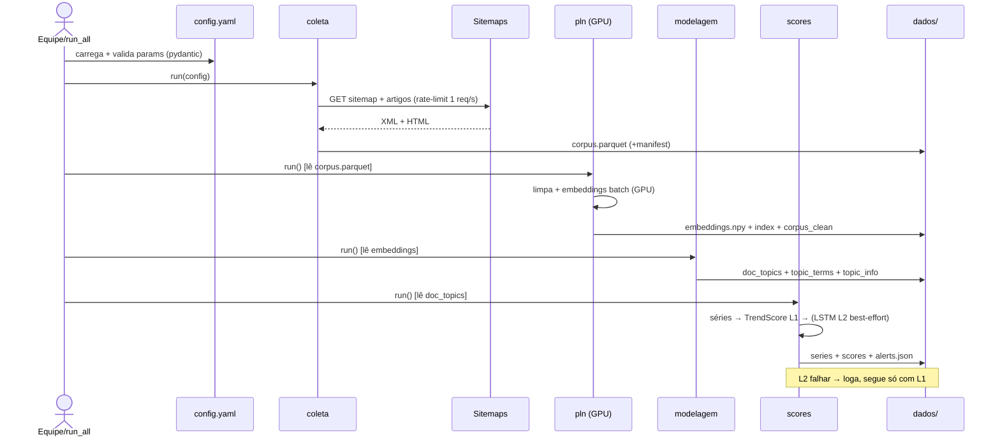
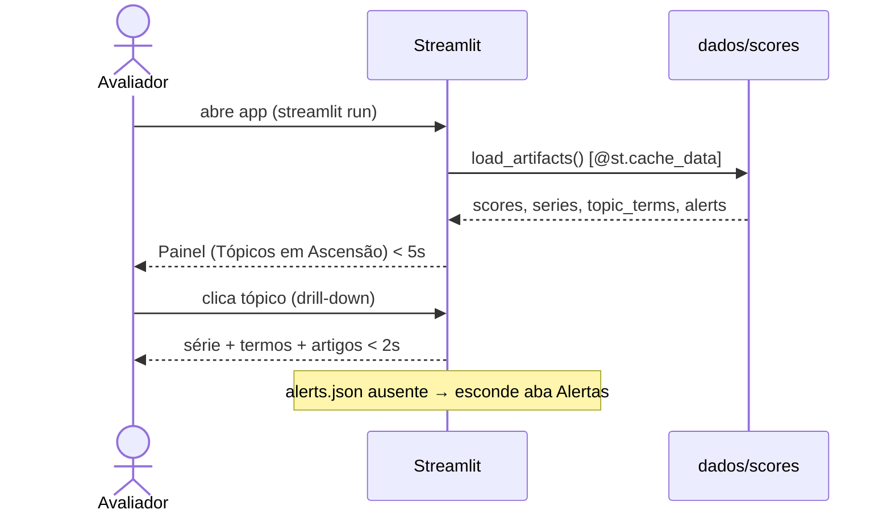

# TrendRadar — Mapeador de Tendências em Tecnologia: Fullstack Architecture Document

> **Autor:** @architect (Aria) | **Data:** 2026-06-09 | **Versão:** 1.0
> **Entradas:** `docs/prd.md` (v1.1), `docs/design/trend-score.md`, `docs/research/2026-06-08-backfill-historico/findings.md`
> **Contexto:** Projeto Integrador final — Curso de IA (1200h) | Prazo: ~2 semanas | 4 integrantes | 1 GPU local
> **Próximo:** Handoff para @sm (quebra de stories) / @dev (implementação), começando pelo Epic 1

---

## Introduction

Este documento descreve a arquitetura completa do **TrendRadar** — um pipeline batch de PLN + Deep Learning, offline e reprodutível, com dashboard Streamlit. Diferente do template fullstack web padrão, **não há frontend/backend web, API REST, autenticação nem banco transacional**: o sistema é um monólito batch em Python cujo acoplamento entre fases se dá **exclusivamente por contratos de arquivo (artefatos versionados em disco)**. Esta é a fonte única da verdade técnica para o desenvolvimento orientado por IA e para os 4 integrantes.

### Nota de adequação do template

O `fullstack-architecture-tmpl` é orientado a web app. Seções inerentemente web foram marcadas **N/A explícito** (Auth, REST/GraphQL, CDN, E2E, ambientes staging/prod, monitoring de produção) para respeitar o princípio **No Invention**. As seções de dados foram reinterpretadas para o domínio ML: "Data Models" → **Contratos de Artefatos**; "Database Schema" → **schema do dataset + artefatos Parquet**.

### Starter Template

N/A — projeto greenfield Python, sem starter. Estrutura modular definida abaixo.

### Change Log

| Date | Version | Description | Author |
|------|---------|-------------|--------|
| 2026-06-09 | 1.0 | Arquitetura inicial: pipeline batch, contratos de artefatos, ADR-001 Trend Score, stack com Poetry | Aria (@architect) |

---

## High Level Architecture

### Technical Summary

O TrendRadar é um **monólito batch de processamento offline em Python**, organizado como um **pipeline linear de 5 estágios** (`coleta → pln → modelagem → temporal/score → dashboard`), onde cada estágio **lê e escreve artefatos versionados em disco** (Parquet/NPY/JSON), e um app **Streamlit read-only** consome apenas os artefatos pré-computados do estágio final. O acoplamento entre estágios é **só via contrato de arquivo** (não chamadas diretas) — o que permite os 4 integrantes desenvolverem fases em paralelo contra schemas fixos e torna o demo 100% reprodutível offline (NFR3). A computação pesada (embeddings, LSTM) roda em **GPU local via PyTorch**; o resto é CPU-bound com pandas. A "fonte da verdade" é o conjunto de artefatos em `dados/`.

### Repository Structure

**Monorepo Python único**, módulos por fase sob `src/`, artefatos sob `dados/` (subpastas por estágio), config central em `config/`. Imports absolutos a partir de `src/`. Sem ferramenta de monorepo JS (Nx/Turbo). Gestão de ambiente e dependências via **Poetry** (`pyproject.toml` + `poetry.lock`).

### High Level Architecture Diagram



### Architectural Patterns

- **Pipeline / Stages-and-Artifacts:** cada fase é uma etapa pura `entrada(arquivo) → saída(arquivo)`. _Rationale:_ desacopla as fases, permite paralelismo de equipe e reprocessamento parcial; substitui "API entre serviços" por "contrato de arquivo".
- **Materialized Artifacts (precompute-then-serve):** o dashboard nunca calcula nada pesado; só lê artefatos prontos. _Rationale:_ garante NFR3 (demo offline) e NFR8 (carga < 5 s).
- **Config-as-Code (single source):** todos os parâmetros tunáveis num `config.yaml` central, validado por pydantic. _Rationale:_ a banca valoriza tuning justificado (spec §5); evita números mágicos.
- **Pure functions + thin I/O shell:** lógica determinística isolada de I/O para ser testável unitariamente. _Rationale:_ NFR5/NFR6 e testabilidade sob prazo curto.
- **Graceful degradation (Camada 2 opcional):** se a LSTM não roda/perform, o dashboard cai para a Camada 1. _Rationale:_ plano B do PRD (FR7 MUST vs FR8 SHOULD).

---

## Tech Stack

Fonte única da verdade tecnológica — todo o `pyproject.toml` deriva daqui.

| Categoria | Tecnologia | Versão (mín.) | Propósito | Rationale |
|---|---|---|---|---|
| Linguagem | Python | 3.12 | Toda a stack | Ecossistema ML/PLN |
| Gerência de env/deps | **Poetry** | 1.8+ | `pyproject.toml` + `poetry.lock` | Env determinístico travado por hash; um só tool p/ deps/venv/build |
| Coleta HTTP | requests + lxml | 2.32 / 5.x | Baixar/parsear sitemap | Leve; lxml rápido p/ XML grande |
| Extração de texto | trafilatura | 1.12 | Texto limpo de artigos | Boa relação esforço/qualidade; validado na PoC |
| Dados tabulares | pandas + pyarrow | 2.2 / 17.x | DataFrames + Parquet | Parquet colunar tipado = contrato robusto |
| Numérico | numpy | 1.26 | Vetores, séries, `.npy` | Base |
| Embeddings | sentence-transformers | 3.x | Vetorização semântica PT | API simples sobre HF/PyTorch; batch GPU |
| Modelo de embedding | paraphrase-multilingual-mpnet-base-v2 | — | PT/multilíngue | Melhor qualidade PT; fallback `...MiniLM-L12-v2` se tempo apertar |
| Topic modeling | BERTopic | 0.16 | UMAP→HDBSCAN→c-TF-IDF | Empacota o pipeline; não reimplementar |
| Deep Learning | PyTorch (+CUDA) | 2.4 | LSTM (Camada 2) | GPU local |
| Baseline temporal | statsmodels | 0.14 | Seasonal-naive/MM | Comparação honesta obrigatória (NFR6) |
| Config | PyYAML + pydantic | 6.x / 2.x | `config.yaml` tipado | Config-as-code validada |
| Dashboard | Streamlit | 1.38 | App read-only | Rápido de construir |
| Visualização | Plotly | 5.x | Séries, barras, grafo | Interativo, integra com Streamlit |
| Grafo | NetworkX | 3.x | Co-ocorrência de termos | FR10 |
| Testes | pytest | 8.x | Unitários (parser, score, séries) | NFR5 |
| Lint/format | ruff | 0.6 | Lint + format | Um só tool; padroniza 4 devs |
| Versionamento de dados | Git LFS (ou DVC) | — | Dataset congelado pesado | Reprodutibilidade do demo |
| CI/CD · Auth · API · CDN | **N/A** | — | — | Produto offline read-only |

### Environment com Poetry (PyTorch + CUDA)

PyTorch com CUDA vem de índice próprio (não PyPI). Resolver via source explícito:

```toml
[tool.poetry.dependencies]
python = "^3.12"
torch = { version = "^2.4", source = "pytorch-cu124" }
sentence-transformers = "^3.0"
bertopic = "^0.16"
pandas = "^2.2"
pyarrow = "^17.0"
statsmodels = "^0.14"
streamlit = "^1.38"
plotly = "^5.22"
networkx = "^3.3"
pydantic = "^2.8"
pyyaml = "^6.0"
trafilatura = "^1.12"
lxml = "^5.2"
requests = "^2.32"

[tool.poetry.group.dev.dependencies]
pytest = "^8.3"
ruff = "^0.6"

[[tool.poetry.source]]
name = "pytorch-cu124"
url = "https://download.pytorch.org/whl/cu124"
priority = "explicit"

[tool.poetry.scripts]
trendradar = "run_all:main"
```

**Regras:** `priority = "explicit"` é obrigatório (senão o Poetry tenta resolver tudo no índice do PyTorch). Casar `cu124` com o driver da GPU (fallback `cu121`/`cu118`/`cpu`). CPU-only roda mais lento — mitigado pelo MiniLM.

---

## Contratos de Artefatos entre Fases (Data Models)

Os "modelos de dados" deste sistema **são os artefatos em disco**. Estes contratos são lei — permitem desenvolvimento paralelo. Tudo sob `dados/`. Chaves de junção em **negrito**.

### A1 — `dados/raw/corpus.parquet` _(produz: Coleta · consome: PLN)_

| Coluna | Tipo | Descrição |
|---|---|---|
| **`doc_id`** | string (hash da url) | Chave primária estável do artigo |
| `data` | date (ISO) | Data de publicação |
| `titulo` | string | Título |
| `texto` | string | Corpo extraído (trafilatura) |
| `fonte` | category | `olhar_digital` \| `canaltech` \| `gdelt` |
| `categoria` | string \| null | Categoria da URL |
| `url` | string | URL canônica (deduplicação) |

_Garantias:_ deduplicado por `url`; `texto` não-vazio (falhas logadas e excluídas).

### A2 — PLN _(produz: PLN · consome: Modelagem)_
- `dados/processed/corpus_clean.parquet`: schema de A1 **+** `texto_limpo: string`, **menos** linhas filtradas. Mantém **`doc_id`**.
- `dados/processed/embeddings.npy`: matriz `float32 [N, D]` (D=768 mpnet / 384 MiniLM). **Ordem alinhada linha-a-linha** com `corpus_clean`.
- `dados/processed/embeddings_index.parquet`: `{**doc_id**, row_idx}` — contrato anti-desalinhamento.

### A3 — Modelagem _(produz: Modelagem · consome: Temporal/Score)_
- `dados/topics/doc_topics.parquet`: `{**doc_id**, data, topic_id}` — `topic_id = -1` para outliers.
- `dados/topics/topic_terms.parquet`: `{**topic_id**, term, ctfidf_weight, rank}` — top-N termos (rótulo automático).
- `dados/topics/topic_info.parquet`: `{**topic_id**, label, size, first_seen_date, last_seen_date}`.

### A4 — Temporal/Score _(produz: Scores · consome: Dashboard)_
- `dados/scores/series.parquet`: `{**topic_id**, data, count}` — série diária com **zero-fill**; opcional `count_weekly`.
- `dados/scores/scores.parquet` (Camada 1): `{**topic_id**, T, R, P, growth, volume, z, trend_score, is_new, support_ok, rank}`.
- Camada 2 **acrescenta** colunas: `{pred, surprise, surprise_z, baseline_mae, baseline_rmse, lstm_mae, lstm_rmse}`.
- `dados/scores/alerts.json`: lista `{topic_id, label, surprise_z, T}` com `surprise_z > k`. **Ausente/vazio ⇒ dashboard degrada graciosamente.**

### Transversal — `dados/run_manifest.json`
`{run_id, timestamp, config_hash, model_name, n_docs, n_topics, stage_versions, params}` — carimbo de reprodutibilidade.



> **Decisão crítica:** `doc_id` (hash da URL) é a chave que atravessa **todas** as fases. O `embeddings_index.parquet` blinda contra o erro nº 1 em pipelines de embedding: desalinhar a matriz `.npy` do DataFrame. O `scores.parquet` é evolutivo (L1 escreve base, L2 acrescenta) → o dashboard checa presença de coluna para degradar.

---

## Componentes (Fases do Pipeline)

**C1 — `src/coleta`** _(owner: integrante A)_
- **Responsabilidade:** sitemap → URLs datadas → extração → `corpus.parquet`.
- **Interfaces:** `listar_urls(config) → DataFrame`; `extrair_artigos(urls, config) → A1`.
- **Dependências:** requests, lxml, trafilatura. Externas: sitemaps (rate-limit ~1 req/s, robots.txt).

**C2 — `src/pln`** _(owner: integrante B)_
- **Responsabilidade:** limpeza PT-BR + embeddings GPU → A2.
- **Interfaces:** `limpar(A1) → corpus_clean`; `embed(corpus_clean, model) → (embeddings.npy, embeddings_index)`.
- **Dependências:** sentence-transformers, PyTorch. Consome: A1.

**C3 — `src/modelagem`** _(owner: integrante C)_
- **Responsabilidade:** BERTopic (UMAP→HDBSCAN→c-TF-IDF) → A3. Recebe embeddings prontos, **não recomputa**.
- **Interfaces:** `modelar(embeddings, corpus_clean) → (doc_topics, topic_terms, topic_info)`.
- **Dependências:** BERTopic. Consome: A2.

**C4 — `src/scores`** _(owner: integrante D — coração analítico)_
- **Responsabilidade:** séries + Trend Score Camada 1 + LSTM/baseline Camada 2 → A4.
- **Interfaces:** `montar_series(doc_topics) → series`; `trend_score_l1(series, params) → scores`; `surpresa_l2(series, params) → scores(+cols), alerts`.
- **Dependências:** pandas, numpy, statsmodels, PyTorch. Consome: A3.

**C5 — `src/dashboard`** _(owner: D/B, fase final compartilhada)_
- **Responsabilidade:** Streamlit read-only lendo A4 + `topic_terms`.
- **Interfaces:** `app.py`; `load_artifacts()` cacheado (`@st.cache_data`).
- **Dependências:** streamlit, plotly, networkx. Consome: A4 + A3b.

**Transversal — `src/common`:** `config.py` (pydantic), `io.py` (read/write Parquet + manifesto), `logging.py`.



> Ownership por fase mapeia 1:1 nos 4 integrantes após o Epic 1. C5 é colaborativo no fim.

---

## Core Workflows

### Execução do pipeline (batch)



### Apresentação (dashboard)



---

## Database Schema (Dataset & Artefatos)

Não há SGBD. O "schema" é o conjunto de artefatos Parquet/NPY/JSON descrito em **Contratos de Artefatos**. Formato primário: **Parquet** (colunar, tipado, via pyarrow) para tabelas; **NPY** (float32) para embeddings densos; **JSON** para alertas/manifesto. Versionamento via Git LFS (`*.parquet`, `*.npy`).

---

## Unified Project Structure

```plaintext
trendradar/
├── config/
│   └── config.yaml              # params: fontes, w, α, H, λ, n_min, k, modelo embedding
├── src/
│   ├── common/                  # config.py (pydantic), io.py (parquet+manifest), logging.py
│   ├── coleta/                  # sitemap.py, extract.py, run.py
│   ├── pln/                     # clean.py, embed.py, run.py
│   ├── modelagem/               # topics.py (BERTopic), run.py
│   ├── scores/                  # series.py, trend_score.py (L1), forecast.py (L2 LSTM+baseline), run.py
│   └── dashboard/               # app.py, panels.py, graph.py
├── dados/                       # ARTEFATOS (Git LFS) — fonte da verdade
│   ├── raw/                     # corpus.parquet
│   ├── processed/               # corpus_clean.parquet, embeddings.npy, embeddings_index.parquet
│   ├── topics/                  # doc_topics, topic_terms, topic_info
│   ├── scores/                  # series, scores, alerts.json
│   └── run_manifest.json
├── tests/                       # test_sitemap.py, test_trend_score.py, test_series.py ...
├── docs/                        # prd.md, architecture.md, design/, research/, architecture/adr-001-trend-score.md
├── notebooks/                   # exploração (fora do caminho de produção)
├── run_all.py                   # orquestra C1→C2→C3→C4
├── pyproject.toml               # deps, scripts, config de tools (ruff, pytest)
├── poetry.lock                  # versões + hashes travados (commitado)
├── .gitignore                   # ignora __pycache__, .venv, dados não-LFS
├── .gitattributes               # Git LFS p/ *.parquet *.npy
└── README.md                    # setup + reprodução do demo offline
```

> `run.py` por módulo (`python -m src.coleta.run`) habilita trabalho paralelo; `run_all.py` encadeia tudo para o demo. `notebooks/` fora do caminho de produção evita "demo que só roda no notebook do fulano".

---

## Development Workflow

**Prerequisites:** Python 3.12, Poetry 1.8+, Git + Git LFS, driver NVIDIA (CUDA 12.4) ou modo CPU.

```bash
# Setup inicial (uma vez)
git clone <repo> && cd trendradar
git lfs install && git lfs pull
poetry install

# Fases isoladas (trabalho paralelo dos 4)
poetry run python -m src.coleta.run
poetry run python -m src.pln.run
poetry run python -m src.modelagem.run
poetry run python -m src.scores.run

# Pipeline completo + dashboard
poetry run trendradar
poetry run streamlit run src/dashboard/app.py

# Qualidade
poetry run pytest
poetry run ruff check . && poetry run ruff format .
```

**Branching:** branch por story (`feat/1.2-coletor-sitemap`), PR para `main`. Push/PR exclusivos do @devops.

---

## Testing Strategy

```
        Backtest (aceitação de produto) — Story 3.4
       /                                  \
   Validação manual (clustering, dashboard visual)
      /                                    \
  Unit (parser sitemap, Trend Score L1, séries, growth/z, zero-fill)
```

- **Unitários (pytest):** `trend_score.py`, `series.py`, `sitemap.py`. Fixtures com séries sintéticas.
- **Não testado unitariamente:** embeddings, BERTopic, LSTM (estocásticos/GPU) → validação manual + métricas (MAE/RMSE vs baseline).
- **Aceitação:** backtest (tendência conhecida sobe pós-surto).

---

## Coding Standards (críticos para devs/agentes)

- **Contrato de artefato é lei:** ler/escrever artefatos **só** via `src/common/io.py`.
- **`doc_id` imutável:** nunca regenerar/reordenar.
- **Embeddings alinhados:** nunca persistir `.npy` sem o `embeddings_index.parquet` no mesmo passo.
- **Config centralizada:** parâmetros só via objeto pydantic de `config.yaml` — sem número mágico.
- **Funções puras na lógica:** cálculo separado de I/O e GPU.
- **PyTorch source:** `torch` sempre da source `pytorch-cu124` com `priority=explicit`.
- **Reprodutibilidade:** fixar `seed`/`random_state` em UMAP/HDBSCAN/LSTM onde possível.

| Elemento | Convenção | Exemplo |
|---|---|---|
| Módulos/arquivos | snake_case | `trend_score.py` |
| Funções | snake_case verbo | `montar_series()` |
| Artefatos | snake_case.parquet | `doc_topics.parquet` |
| Colunas | snake_case | `surprise_z` |
| Config keys | snake_case | `n_min`, `lambda_burst` |

---

## Error Handling Strategy

- **Coleta (rede, falível):** falha por artigo logada e pulada, nunca aborta o lote. Retry leve (1–2x) com backoff em timeout.
- **Fases de processamento:** fail-fast com log claro (estágio, `doc_id`/`topic_id`, causa) — não produzir artefato corrompido. `run_manifest.json` registra sucesso/falha por estágio.
- **Camada 2 (LSTM):** best-effort isolada — exceção loga e **não escreve `alerts.json`** (dashboard degrada para L1). Único ponto onde "falhar é OK".
- **Dashboard:** artefato faltando → aviso amigável, não stack trace.
- **Logging:** `src/common/logging.py` padroniza formato; nível por `config.yaml`.

---

## Security and Performance

- **Security:** N/A para auth/CORS/CSP (offline read-only). Relevantes e implementados em `src/coleta`: respeito a robots.txt/ToS, rate-limit ~1 req/s, sem PII (LGPD/NFR4).
- **Performance:** dashboard carrega tela principal < 5 s e responde drill-down/filtros < 2 s sobre dataset congelado (NFR8), garantido pelo padrão precompute-then-serve + `@st.cache_data`. Embeddings em batch GPU (NFR2).

## Monitoring and Observability

N/A para produção (sem deploy). Observabilidade local = logging estruturado + `run_manifest.json` (auditável pela banca).

---

## ADR

- **ADR-001 — Trend Score de 2 camadas:** ver `docs/architecture/adr-001-trend-score.md`.

---

## Checklist Results Report

> **Executado:** `architect-checklist` (modo comprehensive) — 2026-06-09 por Aria (@architect).
> **Tipo de projeto:** Pipeline batch ML / serviço offline + dashboard read-only. Seções `[[FRONTEND ONLY]]` (3.2, 4, 7.3, 10) puladas por tipo (Streamlit sem framework SPA; acessibilidade fora de escopo no PRD).

**Prontidão geral:** 🟢 **HIGH** — READY FOR DEVELOPMENT. Sem must-fix.

| Seção | Pass | Observação |
|---|---|---|
| 1. Requirements Alignment | 🟢 ~90% | FRs mapeados a componentes/artefatos; scalability N/A (corpus fixo offline) |
| 2. Architecture Fundamentals | 🟢 100% | Diagramas, componentes, fluxos e padrões com rationale |
| 3. Technical Stack & Decisions | 🟢 ~90% | Versões mínimas na tabela; pinning exato via `poetry.lock` |
| 5. Resilience & Operational | 🟢 ~85% | Error handling forte; monitoring/deploy de produção N/A (justificado) |
| 6. Security & Compliance | 🟢 ~85% | LGPD/robots/rate-limit cobertos; auth/infra N/A (offline) |
| 7. Implementation Guidance | 🟢 ~90% | Coding standards, testes, dev env (Poetry), ADR e diagramas |
| 8. Dependency & Integration | 🟢 100% | Deps mapeadas; fallbacks (MiniLM/CPU/cu121); build order claro |
| 9. AI Agent Suitability | 🟢 100% | Componentes bem dimensionados, interfaces explícitas, pitfalls documentados |

**Top riscos:** (1) atrito GPU/CUDA no Poetry → source explícito + fallback; (2) séries curtas → Camada 1 + baseline; (3) desalinhamento embeddings → `embeddings_index` + `doc_id` imutável; (4) cota Git LFS → `--rebuild`; (5) qualidade clustering → gate manual ≥70%.

**Should-fix:** confirmar a versão CUDA do driver da GPU da equipe antes do `poetry install`.

**Decisão final:** ✅ **READY FOR DEVELOPMENT** — handoff para @sm (stories) / @dev (implementação), começando pelo Epic 1.

---

## Next Steps

### Para @sm (River)
Quebrar os 4 épicos do PRD em stories prontas, respeitando os **contratos de artefatos** (cada story produz/consome artefatos definidos aqui) e o **ownership por fase**. Começar pelo **Epic 1 (Coleta)** — caminho crítico que destrava as demais fases.

### Para @dev (Dex)
Implementar na ordem dos contratos: `src/common` (io/config/logging) primeiro, depois C1→C2→C3→C4→C5. Camada 1 do Trend Score antes da Camada 2. Seguir os Coding Standards (contrato de artefato é lei, `doc_id` imutável, config centralizada).

### Para @data-engineer (Dara) — opcional
Se a equipe quiser, revisar os schemas dos artefatos Parquet e a estratégia de particionamento/versionamento (Git LFS vs DVC).
